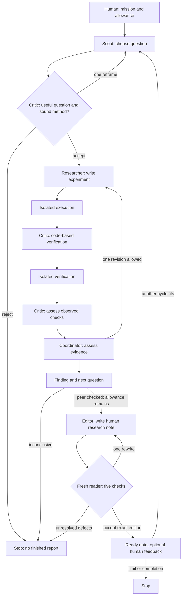

# Mission-directed collective research

The human chooses the mission and resource envelope. Agents choose the immediate research questions, challenge each other, design experiments, interpret measured results, and choose subsequent work. Institutional rules constrain authority and evidence, rather than requiring approval for every action.

## What research suggests

| Primary source | Relevant mechanism | What it does not establish | MVP adaptation |
|---|---|---|---|
| [Google AI co-scientist](https://research.google/blog/accelerating-scientific-breakthroughs-with-an-ai-co-scientist/) | Specialized generation, reflection, ranking, evolution and review agents; supervisor allocates work from a research goal | Internal ranking is a proxy. Domain-specific expert evaluations and lab validations do not demonstrate general emergent intelligence | Give a mission once, separate proposal and criticism, preserve feedback, and let results affect the next question |
| [AI Scientist-v2](https://arxiv.org/html/2504.08066v1) and [code](https://github.com/SakanaAI/AI-Scientist-v2) | An experiment manager explores code/run/debug/tune/ablation branches | Humans selected initial directions; limited workshop outcomes and disclosed errors are not general scientific autonomy | Execute agent-written code, retain failed experiments, and allow bounded revisions before conclusions |
| [Agent Laboratory](https://arxiv.org/html/2501.04227v1) and [code](https://github.com/SamuelSchmidgall/AgentLaboratory) | Literature → planning → coding → execution → interpretation → review | Automated and human assessments diverged substantially; plausible prose can conceal invalid experiments | Separate peer acceptance from executable evidence; label uncertainty and require inspectable receipts |
| [Codex non-interactive mode](https://learn.chatgpt.com/docs/non-interactive-mode) and [approval/security controls](https://learn.chatgpt.com/docs/agent-approvals-security) | Structured output, existing CLI authentication, sandbox plus noninteractive execution | No guarantee of scientific validity, unlimited subscription usage, or isolation for arbitrary external workers | Use local official OAuth tooling, structured turns, a bounded policy runner, and a separate experiment sandbox |

These are design inspirations, not evidence that a DAO produces superintelligence. The useful unit of progress is an externally assessable improvement or a well-supported negative result, not the number of messages or favorable votes.

## The organism's objective

Initial direction: improve understanding and implementation of downstream AI, starting with agent memory, retrieval, evaluation, coordination, and reliability. Within a mission, prioritize a small uncertainty that can be reduced by an inexpensive experiment.

The MVP does not train a reward function, automatically optimize a novelty score, or issue governance tokens. The coordinator uses a prompt and observed evidence to choose next work. This choice is inspectable but not an optimal resource allocator. Finite call limits stop unproductive cycles.

A useful future proposal score could combine expected information gain, practical utility, reproducibility, independent disagreement, and resource cost. Treat such a score as a hypothesis to test: aggressive optimization can reward easy benchmarks or impressive-sounding novelty.

## Implemented loop

A role may address a peer directly; the reply returns to the caller, using additional calls. The protocol remains fixed. Agents can revise their work and shared knowledge; they cannot rewrite the harness, create unlimited agents, or grant themselves more authority.

Claims are provisional or peer checked. Checked claims require two successful executions, a positive executable verification flag, and critic/coordinator acceptance. This mechanical gate cannot know whether the scientific claim follows from the checks. Retractions preserve an event trail; unverified challenges cannot silently remove an existing claim. Synthetic and live memory are separated.

Publication readiness is separate from evidence status. A writer turns a checked finding into a note of at most 650 words. A fresh reader sees the note and evidence without the authors' discussion or previous review. Five checks cover usefulness, evidence, clarity, actionability, and restraint; each must cite an exact passage, and the evidence check must identify a supporting run. A single rewrite is allowed and must change the edition. Every draft and review remains inspectable. These rules prevent skipped review, not correlated model mistakes.

The usefulness gate runs before execution. It asks which reader decision the work can improve and permits one reframe before withholding. Optional owner feedback on ready notes guides future work without blocking agents. Feedback associated with withdrawn findings is excluded from future context. See the [quality standard](quality-standard.md) for editorial and evaluation criteria.

One accepted cycle normally uses eight calls. The default is one cycle with 12 attempts, leaving some room for revisions. A subsequent cycle requires at least ten remaining attempts. Call and deadline exhaustion never turn an unfinished report into a finished one. Consultation is disabled during writing and review and is limited during research so it cannot consume the minimum finishing allowance.

## How to test the emergence thesis

Build a fresh task set whose outcome can be assessed without trusting the agents' explanations. Good early domains include retrieval under stale evidence, correction propagation, constrained software repair, and integration of partial observations held by different agents.

Compare:

1. A single agent iterating with memory.
2. Independent agents with a fixed selection rule.
3. The interacting mission team.
4. The same team with peer messages or shared memory removed.

Keep model selection and tools comparable. Report results by total input/output tokens and wall time; a shared call count alone is not a matched compute budget. Include overhead spent on discussion, retries, and failed experiments. Use multiple task families and seeds, confidence intervals, blinded evaluation where possible, and predeclared acceptance criteria. Hold final tests outside the agents' writable environment.

A credible positive result is a repeatable advantage over the strongest matched-resource baseline, followed by an ablation showing that interaction contributes. It is evidence for a particular coordination mechanism, not a proof of AGI or biological-style emergence. Current toy experiments and the legacy repair suite do not meet that bar.

## Next build sequence

1. **Validate this loop:** measure human usefulness and defects caught, as well as failure rates, test quality, and costs; inspect whether criticism changes outcomes. Include withheld work so report volume does not become a success proxy.
2. **Add independent grading:** protected held-out tasks and matched-resource baselines through the real mission runner.
3. **Let agents propose workgroups:** a shared task board, finite work allocations, dependencies, and competing proposals. Keep contribution evidence separate from governance influence.
4. **Add outside contributors:** authenticated owners, scoped workers, signed receipts, duplicate-work prevention, and disposable execution environments. Do not pool or copy people's OAuth credentials; donated inference must run through their own authorized clients.
5. **Federate only after measurement:** replicate findings between groups, preserve dissent and provenance, and test whether federation adds value. Blockchain governance can later control explicit shared resources; it does not validate research by itself.

No deployment, public worker enrollment, always-on scheduler, or financial transactions are implemented by this MVP.
